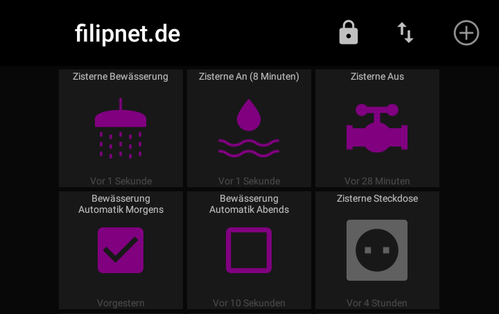

# GardenControl

Automatic irrigation with a cistern pump controlled by Wemos D1 Mini Arduino microcontroller via MQTT



## FEATURES

- Connects to the Wireless Access Pointt / Wifi Router
- Securely connects to the MQTT Broker (TLS)
- Subscribes to the desired MQTT topics
- Handles incoming MQTT messages
- Controls ESP8266 Chip Level Data Pins
- Sends a heartbeat signal to the MQTT broker periodically
- Switches a double relay for cistern pump and a socket
- Checks the status of the cistern pump and switches it off automatically after a certain time (threshold value) if no switch-off signal is received by the specified time (protection against garden flooding)

## REQUIREMENTS

- Wemos D1 Mini (should work with other Arduino microcontrollers too)
- PlatformIO or Arduino IDE (for Arduino IDE you have to move files from /src to root-folder)
- MQTT Broker such as the Mosquitto MQTT Broker (https://mosquitto.org/)
- ControllApp such as MQTT Dash (https://play.google.com/store/apps/details?id=net.routix.mqttdash&hl=en)

## INSTALL AND USAGE

### PINOUT

| Sensor-Description | Sensor-PIN | Arduino-PIN |
| --- | --- | --- |
| SRD-05VDC-SL-C Relais	| GND | GND |
| SRD-05VDC-SL-C Relais	| IN1	| D1 |
| SRD-05VDC-SL-C Relais	| IN2	| D2 |
| SRD-05VDC-SL-C Relais	| VCC	| 5.0 V |	
| SRD-05VDC-SL-C Relais	| NO1 + COM1 | Phase L (230V) Pump |
| SRD-05VDC-SL-C Relais	| NO2 + COM2 | Phase L (230V) Socket |

For safety reasons I have fitted the 230V relay in a separate plastic box (for screws) with self-adhesive velcro tape.


### INTEGRATION OF A SWITCH

After some research, it is basically possible **in parallel to the relay to switch a switch**, which is suitable for outdoor use. This allows the cistern to be switched on and off outside the watering periods.

### LIBRARIES ###

- PubSubClient by Nick O'Leary
- esp8266_mdns by dunk

### UNDERSTANDING RELAY HIGH AND LOW

To switch the relay it is necessary to define the two GPIOs of the Arduino with pinMode as output.
By default, the Arduino microcontroller then switches the output to LOW, which means that the connected relay is switched on, i.e. the pump is running. To prevent this, the PIN must be set to HIGH **before** defining it as an output.
```
  digitalWrite(relayPump, HIGH);
  pinMode(relayPump, OUTPUT);
  digitalWrite(relaySocket, HIGH);
  pinMode(relaySocket, OUTPUT);
```

## DIRECTORIES AND FILES

- src/GardenControl.ino - The main programm code
- src/config.h - GPIO configuration, definition of threshold values, etc.
- src/credentials.h.sample - Sample configuration file for WiFi and MQTT credentials (please rename to secrets.h)
- README.md - The manual for this Arduino Script
- LICENSE - The license notes for this Arduino script
- platformio.ini - Wemos D1 Mini Configuration for PlatformIO

## AUTOMATION WITH NODE-RED

If the cistern pump can now be switched on and off via the MQTT Broker from anywhere in the world, it is naturally obvious to implement automation here. To cover this logic with the Arduino itself and to write it in C-code is quite feasible, but I decided to use the Framwork Node-RED for this, because here workflows can be created without much programming effort.

### PLUGIN REQUIREMENTS

- node-red-contrib-schedex
- node-red-contrib-telegrambot (optional if you would like to get status messages)

### NODE-RED FLOW

Node-RED works with so-called flows, which can be imported and exported. 


An example of a flow can be found in **flows.json** in the github repository.

### MQTT TOPICS

| MQTT Topic | Description | Possible values |
| --- | --- | --- |
| home/outdoor/cistern/pump | Switches the cistern pump on or off | on, off |
| home/outdoor/cistern/pump/trigger | Triggers the Node-RED Workflow | on |
| home/outdoor/cistern/heartbeat | Heartbeat for troubleshooting | on |
| home/outdoor/cistern/emergencystop | Threshold value for pump runtime reached, Arduino has triggered Emergency STOP | on |
| home/outdoor/cistern/automatic/morning | Enables or disables automatic irrigation in the morning | suspended false, suspendet true |
| home/outdoor/cistern/automatic/evening | Enables or disables automatic irrigation in the evening | suspended false, suspendet true |

## CONTROL AND MANAGEMENT

### MQTTDASH

A really outstanding Android app is MQTTDash, which establishes a connection to MQTTBroker, where buttons, graphs, switches, text fields, images and much more can be embedded. Take a look at the screenshot below.
https://play.google.com/store/apps/details?id=net.routix.mqttdash&hl=en

### TELEGRAM

For status messages I use Telegram, here is a well described API and corresponding plugins for Node-RED.


## NEXT GENERATION PLANNING

- [X] Implementation of Emergency STOP function
- [ ] Addition of ultrasonic sensor for level measurement of the cistern
- [ ] Add sole humidity sensors to suspend irrigation e.g. after rain

| Sensor-Description | Sensor-PIN | Arduino-PIN |
| --- | --- | --- |
| Humidity sensor | VCC	| 5.0 V	|
| Humidity sensor	| GND	| GND	|
| Humidity sensor	| A0	| A0	|
| JSN-SR04T-2.0 Ultrasonic Sensor	| VCC	| 5.0 V	|
| JSN-SR04T-2.0 Ultrasonic Sensor	| Trigger |	D5 |
| JSN-SR04T-2.0 Ultrasonic Sensor	| ECHO	| D6 |
| JSN-SR04T-2.0 Ultrasonic Sensor	| GND | GND |

## LICENSE

GardenControl and all individual scripts are under the BSD 3-Clause license unless explicitly noted otherwise. Please refer to the LICENSE